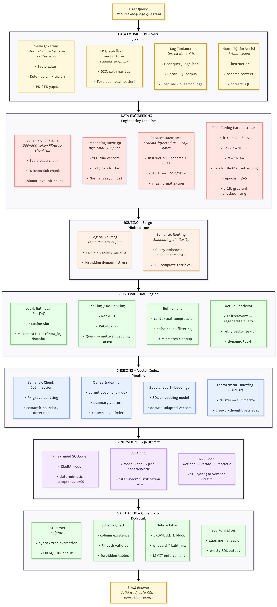

# SQLCoder V2 — Natural Language → SQL Engine  
**Qwen2.5-7B + QLoRA + RAG + Schema-Aware Routing**

Bu proje, doğal dildeki soruları güvenli, optimize ve şema-uyumlu SQL cümlelerine dönüştürmek için geliştirilmiş gelişmiş bir NL→SQL üretim sistemidir.

---

## 🚀 Mimarinin Genel Görünümü



Bu diyagram; veri mühendisliği, RAG yönlendirme, vektör indeksleme, fine-tuning pipeline’ı, self-RAG ve güvenlik aşamalarını içeren uçtan uca NL→SQL sisteminin tamamını özetler.

---

## 📌 Öne Çıkan Özellikler

- Tam şema farkındalığı (tables.json + information_schema)
- FK graph tabanlı JOIN path çıkarımı
- Schema-enforced dataset üretimi (instruction + schema context)
- RAG yönlendirme (top-k retrieval, cosine similarity, metadata filter)
- Embedding pipeline (bge-small / mpnet, semantic chunking)
- QLoRA fine-tuning (4-bit, r=16–32, α=16–64)
- Self-RAG + Reflection loops
- Güvenlik katmanı:
  - DROP/DELETE engeli
  - forbidden tables
  - FK mismatch kontrol
  - AST parser (sqlglot)

---

## 📂 Proje Yapısı

```
sql_coder_V2/
│
├─ dataset.jsonl
├─ test_500.jsonl
├─ tables.json
├─ promt_base..txt
├─ 2711deneme.ipynb
├─ Untitled diagram-2025...png
└─ LICENSE
```

---

## 🔧 Eğitim (Training)

- Qwen/Qwen2.5-7B-Instruct tabanlı
- BitsAndBytes NF4 quantization
- schema-injected dataset
- gradient checkpointing
- cutoff_len = 512/1024

---

## 🧠 Çıktı Üretimi (Inference)

- Soru embedding → semantic routing  
- RAG → template selection  
- Fine-tuned SQLCoder  
- AST doğrulama  
- Güvenli SQL üretimi  

---

## 🔒 Güvenlik & Validasyon

- FK path doğruluğu  
- Tablo/kolon varlığı kontrolü  
- DROP/DELETE engelleme  
- wildcard temizleme  
- SQL normalizasyonu  
- tree-of-thought reflection loop  

---

## 📄 Lisans
MIT License
